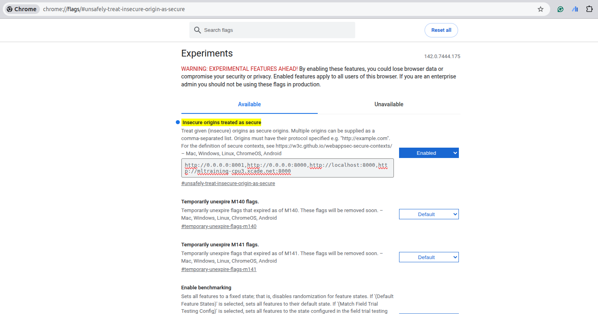

# Fluentia - Voice Agent Platform

**Fluentia** stands for **LI**ve **VO**ice **N**atural Language **I**nterface **A**gent. It is a real-time bidirectional voice agent platform that supports multiple AI providers. Fluentia provides a web-based interface for conducting voice conversations with configurable agents, prompt templates, and tool integration.

## Supported Providers

| Provider | Model | Description |
|----------|-------|-------------|
| **Google Gemini** | Gemini 2.5 Flash (native audio) | Google ADK with optional proactivity and affective dialog |
| **AWS Bedrock** | Amazon Nova Sonic | HTTP/2 bidirectional streaming with tool execution |

## Architecture

```
src/fluentia/
├── app.py              # FastAPI factory, WebSocket endpoint
├── config.py           # Pydantic configuration (env vars)
├── agents/             # Agent definitions with Jinja2 prompt templates
├── session/            # WebSocket session management, event protocol
├── providers/          # Voice provider implementations
│   ├── google.py       # Google ADK provider
│   └── bedrock/        # AWS Bedrock Nova Sonic provider
├── tools/              # Tool framework and implementations
├── observability/      # Structured logging, health checks, metrics
└── static/             # Frontend SPA (HTML/CSS/JS)
```

Key design decisions:

- **Provider abstraction**: All providers implement `BaseProvider.handle_session()` and emit normalized `SessionEvent` objects. The frontend is provider-agnostic.
- **Agents as configuration**: `AgentDefinition` combines a Jinja2 prompt template with metadata (enabled tools, default variables). The same agent works with any provider.
- **Versioned event protocol**: All WebSocket messages include a protocol version, event type, payload, and timestamp. See `docs/reference/websocket-protocol.md`.

## Getting Started

### Prerequisites

- Python 3.13+
- [uv](https://docs.astral.sh/uv/)

### Installation

```bash
# Install uv (if not already installed)
curl -LsSf https://astral.sh/uv/install.sh | sh

# Clone the repository
git clone git@gitlab.xcade.net:fernando.contreras/english-teacher-assistant.git
cd english-teacher-assistant

# Install dependencies
uv sync --group dev

# Install pre-commit hooks
uv run pre-commit install
```

### Running

Set credentials for your provider:

```bash
# Google Gemini
export GOOGLE_API_KEY="your-api-key"

# AWS Bedrock
export AWS_ACCESS_KEY_ID="..."
export AWS_SECRET_ACCESS_KEY="..."
export AWS_SESSION_TOKEN="..."
```

Start the server:

```bash
uv run python -m fluentia.main
```

Open [http://localhost:8000](http://localhost:8000) in your browser.

### Docker

```bash
cp .env.example .env
# Edit .env with your credentials
docker compose up
```

See [Docker Local Deployment](docs/tutorials/docker-local-deployment.md) for details.

## Development

### Code Quality

```bash
# Run all quality checks (ruff format, ruff check, mypy, pylint)
./check_code.sh
```

### Testing

```bash
# Run all checks and tests via tox
uv run tox

# Run unit tests directly (faster for iteration)
uv run pytest

# Run a specific test file
uv run pytest tests/unit/providers/test_google.py -v
```

### Workflow

1. Make code changes
2. Run `./check_code.sh` to verify quality
3. Run `uv run pytest` to verify tests
4. Run `uv run tox` before committing (all checks + all tests)
5. Commit following [Conventional Commits](docs/guides/commit-message-guide.md)

## API Endpoints

| Endpoint | Method | Description |
|----------|--------|-------------|
| `/health` | GET | Liveness probe |
| `/ready` | GET | Readiness probe (provider availability) |
| `/api/agents` | GET | List available agents |
| `/ws/{provider}/{user_id}/{session_id}` | WebSocket | Voice session |

## Browser Microphone Permissions

To use microphone access over non-HTTPS connections (e.g., remote servers):

1. Open Chrome and navigate to `chrome://flags/#unsafely-treat-insecure-origin-as-secure`
2. Add the server URL (e.g., `http://mltraining-services1.xcade.net:8000`)
3. Set the flag to "Enabled"
4. Restart the browser

This is not needed for `localhost`.



## Documentation

### Tutorials

- [Web Demo](docs/tutorials/voice-interview-agent-web-demo.md) - Running the web UI
- [Docker Deployment](docs/tutorials/docker-local-deployment.md) - Local Docker setup
- [CLI Demo (Legacy)](docs/tutorials/voice-interview-agent-cli-demo.md) - PoC command-line script

### Reference

- [WebSocket Protocol](docs/reference/websocket-protocol.md) - Event types, message format, session lifecycle
- [Provider Architecture](docs/reference/provider-architecture.md) - Provider abstraction, Google and Bedrock details
- [Agent and Tool Framework](docs/reference/agent-and-tools.md) - Agent definitions, tool interface, creating new agents/tools

### Guides

- [Code Style Guide](docs/guides/code-style-guide.md) - Python 3.13+ conventions
- [Test Development Guide](docs/guides/test-development-guide.md) - Testing patterns and practices
- [Commit Message Guide](docs/guides/commit-message-guide.md) - Conventional Commits format
- [Technical Writing Style Guide](docs/guides/technical-writing-style-guide.md) - Documentation standards
- [About english-teacher](docs/guides/about-english-teacher.md) - Domain context
